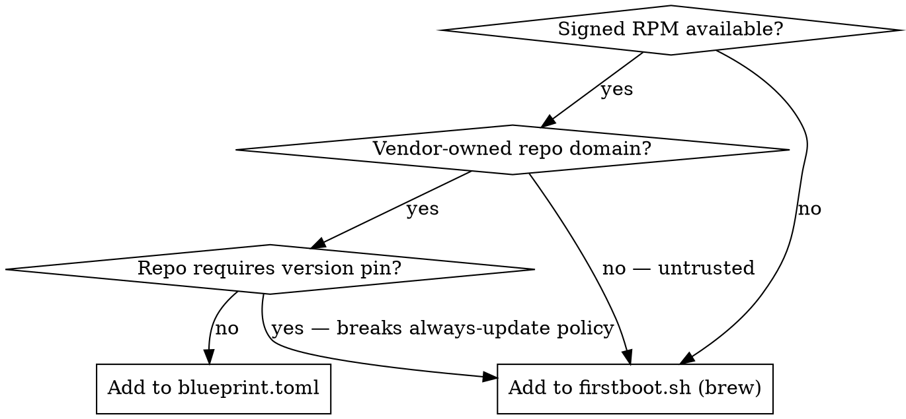

# Add Package to VM

## Decision: RPM or Brew?



**Vendor-owned** = repo domain operated by the software's own publisher (microsoft.com, cloudflare.com, fedoraproject.org). A third-party mirror or JFrog instance does not qualify even with a signed key.

## Adding to blueprint.toml (RPM)

1. Append to the `packages` array:
   ```toml
   { name = "pkg-name", version = "*" },
   ```
2. If the package needs a new external repo, add a `[[customizations.repositories]]` stanza. Required fields: `id`, `name`, `baseurls`, `gpgcheck = true`, `gpgkeys`.
3. Bump `version` at the top of `blueprint.toml`.

## Adding to firstboot.sh (Brew)

1. Add a `brew_install <formula>` line in the brew formulae section.
   - Tapped formulae: `brew_install <tap>/<repo>/<formula>` (e.g. `stripe/stripe-cli/stripe`)
2. Add a comment explaining why not RPM.
3. Still bump `blueprint.toml` `version` — firstboot changes affect the image.

## Always bump blueprint version

Every change affecting the VM image requires a `version` bump in `blueprint.toml`. osbuild uses it for traceability. Patch bump (`0.0.9` → `0.0.10`) for routine tool additions.

## Known decisions

| Tool | Where | Why |
|------|-------|-----|
| kubectl (`kubernetes-cli`) | brew | `pkgs.k8s.io` URL requires minor-version pin |
| stripe-cli | brew | Stripe RPM on third-party JFrog with `gpgcheck=0` |
| actionlint, buf, semgrep, uv, watchexec, ollama, supabase | brew | No signed RPM repo / bleeding-edge |
| azure-cli | blueprint RPM | Official Fedora `updates` repo — no custom repo needed |
| code-insiders, cloudflared | blueprint RPM | Microsoft and Cloudflare own their repo domains |
